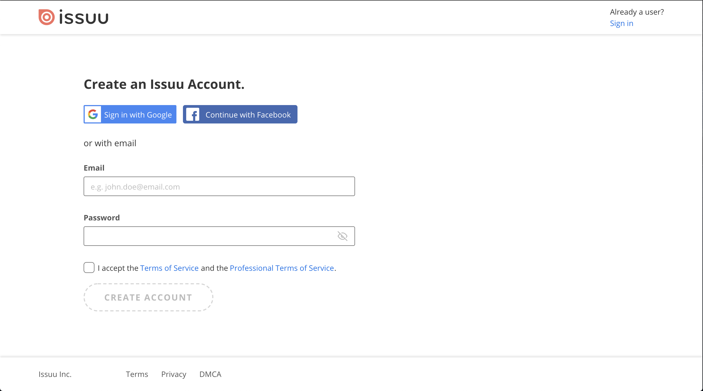

# HTML/CSS S2: Ejercicios

### Ejercicio 1: Issuu register form

Ahora que ya conocemos los formularios, vamos a intentar replicar uno muy sencillito, te dejamos el diseño al final del ejercicio.

Es importante que seas correcto en el uso de las etiquetas, y no te dejes ninguna:

- Form
- Fieldset
- Input
- Label
- ...

Es buen momento para que además de aplicar estas etiquetas de formularios, apliques otras que ya conoces como header, footer, imágenes y enlaces.

Mucha suerte!!

### Ejercicio 2: Mailchimp sign-up form

Como ya habrás observado los formularios están presentes en todas las webs. Son el método más utilizado para la recogida de datos de los usuarios, y por eso es importante que aprendamos a usarlos correctamente.

Vamos a seguir practicando, esta vez vamos a replicar el formulario de creación de una cuenta de Mailchimp, te dejamos el diseño más adelante.

Para darle algo más de "calidad" al formulario, puedes intentar aplicar ciertas reglas de validación (sólo HTML, nada de JavaScript). Puedes usar los siguientes atributos:

- required
- minlength / maxlength
- min / max
- pattern (algo más complejo, requiere hacer uso de expresiones regulares)

Te dejamos algunas referencias que pueden resultarte de utilidad:

- [https://css-tricks.com/form-validation-part-1-constraint-validation-html/](https://css-tricks.com/form-validation-part-1-constraint-validation-html/)
- [https://developer.mozilla.org/en-US/docs/Learn/Forms/Form_validation](https://developer.mozilla.org/en-US/docs/Learn/Forms/Form_validation)

A por ello!

